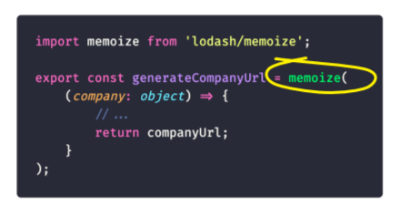
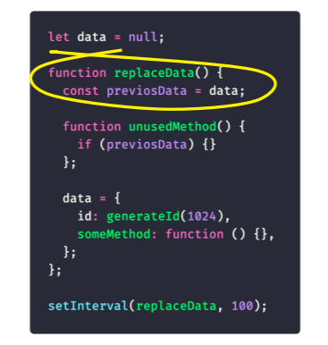

# Memory Leak

[Статья об утечках в SSR](https://habr.com/ru/companies/oleg-bunin/articles/760208/)

Фронтендеры пишут код, который исполняется в браузере. Браузер – это индивидуальная среда исполнения, где у пользователя свои ресурсы. В рамках одной сессии у него небольшое количество действий: десятки, редко – сотни. Под такой нагрузкой утечки себя практически не проявляют. Они могут возникнуть только при устаревшем оборудовании или в старом браузере. А это обычно меньше 1% пользователей.

но утечки памяти – это скорее проблема на клиенте, потому что они приводят к видимой потере фреймрейта и зависанию UI. Из-за них повышается энергопотребление, а значит, батарейка на ноутбуке или телефоне пользователя садится быстрее, чем обычно. Всё это может приводить к блокированию потока и крешу вкладки или браузера. Из-за повышенной нагрузки на процессор пользователь начинает придумывать себе всякие «ужасы». Например, что в клиент встроен майнер. А это точно не тот use-кейс, который хочет получить компания.

_Память в JavaScript в V8_

- Память в V8 условно разделяется на две части – на Stack и Heap memory. В Stack хранятся примитивы, ссылки, фреймы функций и глобальные исполнения. В Heap memory — объекты и прочие динамические данные.

_Механизм работы GC_

_Способы поиска утечек_

Снэпшоты в Девтулзах

_Паттерны Утечек_

1. Глобальные переменные
   Глобальные переменные никогда не удаляются garbage collector, поскольку всегда имеют прямую связь с корневым узлом. Не важно, созданы они специально или случайно.

2. Интервалы, таймеры и подписки

При создании интервалов, таймеров и подписок – мы передаём в них callback.
В callback’е обычно обрабатываются данные. Значит, здесь есть ссылки на них. До тех пор, пока подписка жива, callback будет хранить данные по ссылкам и удерживать их от удаления garbage collector.

При этом, должен быть четкий критерий очистки таймеров. От таймеров, подписок нужно отписываться. Обычно это делают в случае успешного кейса, когда случается целевое событие. Например, пользователь что-то сделал, всё ок, таймер отработал, его можно очищать. Но важно, чтобы был критерий очистки и на негативный случай: когда нужно очистить подписку, если пользователь не сделал своё действие.

Можно ограничить количество исполнений или срок жизни таймера. Просто представьте, что вы этот код поместили в серверную среду, и у тысяч или десятков тысяч пользователей в зависимости от вашей нагрузки теперь есть 10 000 таймеров, которые никогда не исполняются. А в едином окружении все ресурсы, которые удерживают callback’и, тратят общую память.

3. Кэш и мемоизация

Кэш и мемоизация – это кейс Зарплата.ру. Именно в нём у нас произошла утечка памяти. Давайте разберём в деталях:  

Там была функция generate company url, которая создавала какую-то строку из объекта компании. Пользователь в ходе поиска вакансии обычно открывает одну и ту же компанию несколько раз. Сначала смотрит описание, потом контакты, потом ещё какие-то условия. Поэтому мы решили оптимизировать функцию, обернуть её в memoize, чтобы не считать каждый раз одно и то же.

Проблема в том, что этот код не работает:

Memoize из lodash использует первый аргумент функции как ключ. В этом кейсе первый аргумент – это объект. То есть создают в кэше записи, у которых ключ – это объект. Потом ищут по кэшу записи, сопоставляя объекты. В JavaScript объекты не равны друг другу, значит мемоизация просто не работает.

Плодятся повторы. Если пользователь три раза откроет страницу, он три раза загрузит одни и те же данные в кэш, но сохранит их как новые.

К тому же, у lodash в memoize отсутствуют механизмы инвалидации кэша. Значит он растёт бесконечно. И ещё memoize использует для кэша объекты и map, которые генерируют сильные ссылки и препятствуют работе garbage collector.

Чтобы решить эту проблему, во-первых, не кэшируйте всё подряд. Скорее всего, функция создания строки из объекта не настолько тяжеловесная. Во-вторых, не используйте ключи как объекты. Конкретно у memoize есть второй аргумент – резолвер, где можно задавать кастомный ключ и высчитывать его.

Нам, к сожалению, эти способы не подходили, потому что отсутствовал механизм инвалидации кэша. Ссылки loadash все равно бы хранились вечно. Поэтому мы пошли другим путём.

Если реализовывать кэширование самостоятельно, можно использовать WeakMap и WeakSet, а не объекты или массивы. WeakMap и WeakRef создают слабые ссылки и не препятствуют работе сборщика мусора.

4. Замыкания

Давайте разберём следующий код:  

Есть функция – replaceData. Внутри неё, в локальную переменную мы записываем ссылку на какой-то внешний объект – previosData. Есть функция unusedMethod, в которой мы ничего не делаем, только проверяем, пустая previosData или нет. В блоке нет кода. В ходе работы функции во внешнюю переменную Data мы записываем объект. В объекте есть id, длинная строка, чтобы мы увидели утечки быстрее. И пустая функция someMethod без тела и входящих аргументов.

Так создаётся замыкание. В сам Method не поступают никакие аргументы, то есть ссылок он не хранит. В ходе работы мы перезаписываем данные, но не создаём массив и не накапливаем их. Data – это объект, то есть по идее, замыкания плодиться не должны.

Посмотрим, что в нём. Лексический контекст функции занимает основную память:

