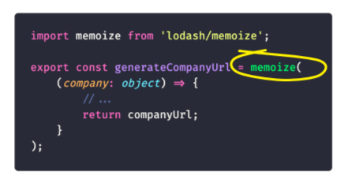
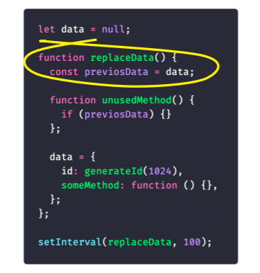
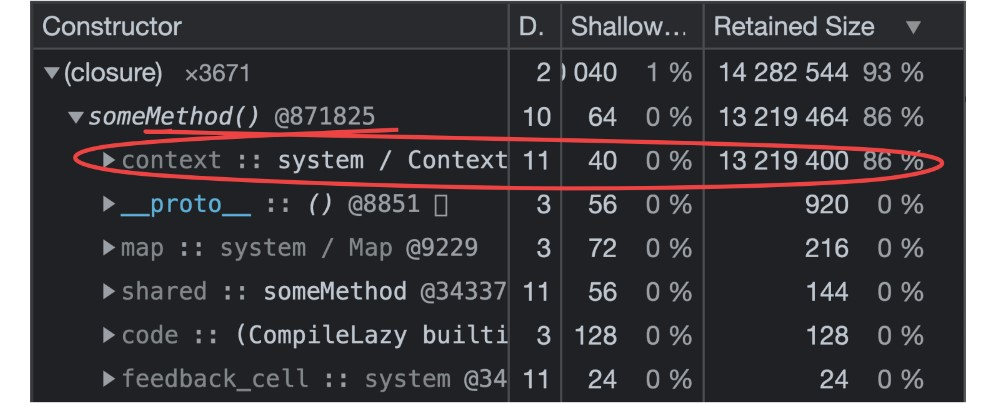
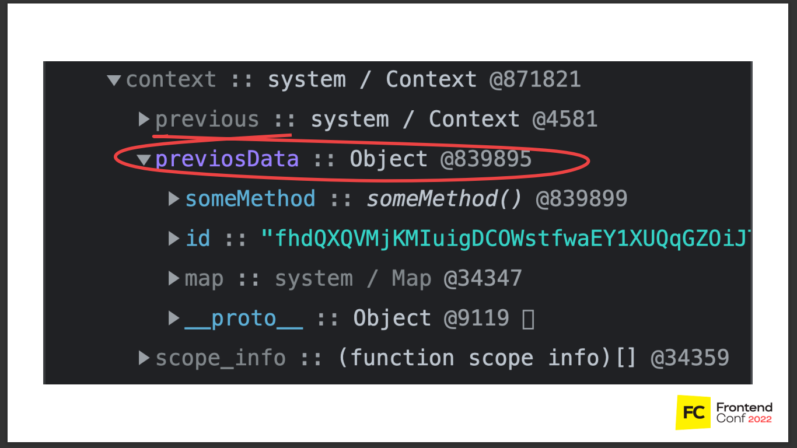

# Memory Leak

- Утечка памяти — память, которая больше не требуется приложению, но по какой-то причине не возвращается операционной системе или пулу доступной памяти

Фронтендеры пишут код, который исполняется в браузере. Браузер – это индивидуальная среда исполнения, где у пользователя свои ресурсы. В рамках одной сессии у него небольшое количество действий: десятки, редко – сотни. Под такой нагрузкой утечки себя практически не проявляют. Они могут возникнуть только при устаревшем оборудовании или в старом браузере. А это обычно меньше 1% пользователей.

но утечки памяти – это скорее проблема на клиенте, потому что они приводят к видимой потере фреймрейта и зависанию UI. Из-за них повышается энергопотребление, а значит, батарейка на ноутбуке или телефоне пользователя садится быстрее, чем обычно. Всё это может приводить к блокированию потока и крешу вкладки или браузера. Из-за повышенной нагрузки на процессор пользователь начинает придумывать себе всякие «ужасы». Например, что в клиент встроен майнер. А это точно не тот use-кейс, который хочет получить компания.

# Память в JavaScript в V8 =============================================

Память в V8 условно разделяется на две части – на Stack и Heap memory. В Stack хранятся примитивы, ссылки, фреймы функций и глобальные исполнения. В Heap memory — объекты и прочие динамические данные.

# Механизм работы GC =============================================

# Способы поиска утечек =============================================

Chrome предоставляет набор инструментов для профилирования расхода памяти в JavaScript. Для работы с памятью предназначены два важнейших инструмента: вкладка timeline и вкладка профилей.
Вкладка timeline

- Снэпшоты в Девтулзах

# Паттерны Утечек =============================================

1. Глобальные переменные

Одной из целей, стоявших при разработке JavaScript, было создать похожий на Java язык, но настолько нестрогий, чтобы с ним могли работать даже новички. Одним из послаблений языка стала обработка необъявленных переменных: обращение к такой переменной создаст новую переменную в глобальном объекте. Таким образом, если рассмотреть код:

```js
function foo(arg) {
    bar = "скрытая глобальная переменная";
}

На самом деле он означает:

function foo(arg) {
    window.bar = "явно объявленная глобальная переменная";
}
```

Глобальные переменные никогда не удаляются garbage collector, поскольку всегда имеют прямую связь с корневым узлом. Не важно, созданы они специально или случайно.

Ещё один способ создать случайную глобальную переменную — использовать this
Чтобы избежать подобных ошибок, добавляйте 'use strict'; в начало JavaScript-файлов. Это директива, включающая строгий режим парсинга JavaScript, препятствующий возникновению случайных глобальных переменных.

2. Интервалы, таймеры и подписки

При создании интервалов, таймеров и подписок – мы передаём в них callback.
В callback’е обычно обрабатываются данные. Значит, здесь есть ссылки на них. До тех пор, пока подписка жива, callback будет хранить данные по ссылкам и удерживать их от удаления garbage collector.

При этом, должен быть четкий критерий очистки таймеров. От таймеров, подписок нужно отписываться. Обычно это делают в случае успешного кейса, когда случается целевое событие. Например, пользователь что-то сделал, всё ок, таймер отработал, его можно очищать. Но важно, чтобы был критерий очистки и на негативный случай: когда нужно очистить подписку, если пользователь не сделал своё действие.

Можно ограничить количество исполнений или срок жизни таймера. Просто представьте, что вы этот код поместили в серверную среду, и у тысяч или десятков тысяч пользователей в зависимости от вашей нагрузки теперь есть 10 000 таймеров, которые никогда не исполняются. А в едином окружении все ресурсы, которые удерживают callback’и, тратят общую память.

3. Кэш и мемоизация

Кэш и мемоизация – это кейс наш. Именно в нём у нас произошла утечка памяти. Давайте разберём в деталях: 

Там была функция generate company url, которая создавала какую-то строку из объекта компании. Пользователь в ходе поиска вакансии обычно открывает одну и ту же компанию несколько раз. Сначала смотрит описание, потом контакты, потом ещё какие-то условия. Поэтому мы решили оптимизировать функцию, обернуть её в memoize, чтобы не считать каждый раз одно и то же.

Проблема в том, что этот код не работает:

Memoize из lodash использует первый аргумент функции как ключ. В этом кейсе первый аргумент – это объект. То есть создают в кэше записи, у которых ключ – это объект. Потом ищут по кэшу записи, сопоставляя объекты. В JavaScript объекты не равны друг другу, значит мемоизация просто не работает.

Плодятся повторы. Если пользователь три раза откроет страницу, он три раза загрузит одни и те же данные в кэш, но сохранит их как новые.

К тому же, у lodash в memoize отсутствуют механизмы инвалидации кэша. Значит он растёт бесконечно. И ещё memoize использует для кэша объекты и map, которые генерируют сильные ссылки и препятствуют работе garbage collector.

Чтобы решить эту проблему, во-первых, не кэшируйте всё подряд. Скорее всего, функция создания строки из объекта не настолько тяжеловесная. Во-вторых, не используйте ключи как объекты. Конкретно у memoize есть второй аргумент – резолвер, где можно задавать кастомный ключ и высчитывать его.

Нам, к сожалению, эти способы не подходили, потому что отсутствовал механизм инвалидации кэша. Ссылки loadash все равно бы хранились вечно. Поэтому мы пошли другим путём.

Если реализовывать кэширование самостоятельно, можно использовать WeakMap и WeakSet, а не объекты или массивы. WeakMap и WeakRef создают слабые ссылки и не препятствуют работе сборщика мусора.

4. Замыкания

Давайте разберём следующий код: 

Есть функция – replaceData. Внутри неё, в локальную переменную мы записываем ссылку на какой-то внешний объект – previosData. Есть функция unusedMethod, в которой мы ничего не делаем, только проверяем, пустая previosData или нет. В блоке нет кода. В ходе работы функции во внешнюю переменную Data мы записываем объект. В объекте есть id, длинная строка, чтобы мы увидели утечки быстрее. И пустая функция someMethod без тела и входящих аргументов.

Так создаётся замыкание. В сам Method не поступают никакие аргументы, то есть ссылок он не хранит. В ходе работы мы перезаписываем данные, но не создаём массив и не накапливаем их. Data – это объект, то есть по идее, замыкания плодиться не должны.

Посмотрим, что в нём. Лексический контекст функции занимает основную память: 

В нём есть ссылка на previosData: 

Но SomeMethod не использует никаких аргументов, он не должен хранить ссылку. Это происходит из-за того, что лексическое окружение создаётся единым для всех создаваемых функций. Это значит, что если какой-то из ваших методов использует данные и у него есть ссылка, а другой не использует, лексическое окружение для них будет одинаковое.

С этим не получится никак бороться, это замыкание. Такие особенности нужно учитывать при написании кода. Не используемый метод обрабатывает какие-то данные, такой кейс важен при рефакторинге. Если вы видите методы, которые не используются, не стесняйтесь их удалять. Возможно из-за них течёт память.

5. Подстроки

Факт на лицо: утечка, создаваемая этой ситуацией, ссылки на родительские строки существует с 2018 года и обсуждается до сих пор. Разработчики движка говорят, что это вариант оптимизации. Движок до конца не уверен, когда ему лучше хранить ссылку, а когда пересоздавать строку при создании подстроки.

6. Ссылки на удаленные из DOM элементы

Иногда полезно хранить DOM-узлы внутри структур данных. Предположим, вы хотите точечно обновить содержимое нескольких строк в таблице. Имеет смысл сохранить ссылку на каждый DOM-ряд в словаре или массиве. В этом случае на один и тот же DOM-элемент будут указывать две ссылки — одна в DOM-дереве, а вторая в словаре. Если в будущем вы решите удалить эти строки, вам понадобится сделать и ту, и другую ссылку недостижимыми.

```js
var elements = {
  button: document.getElementById("button"),
  image: document.getElementById("image"),
  text: document.getElementById("text"),
};

function doStuff() {
  elements.image.src = "http://some.url/image";
  elements.button.click();
  console.log(elements.text.innerHTML);
  // Остальная логика.
}

function removeButton() {
  // Кнопка находится непосредственно в body.
  document.body.removeChild(document.getElementById("button"));

  // В этом случае мы всё равно ссылаемся на #button
  // в глобальном объекте elements.
  // Т.е. кнопка до сих пор находится в памяти
  // и не может быть удалена сборщиком мусора.
}
```

В дополнении к этому нужно что-то делать со ссылками на внутренние узлы DOM-дерева. Предположим, что мы храним в коде ссылку на какую-то конкретную ячейку таблицы (на тег <td>). В будущем мы решаем убрать таблицу из DOM, но сохранить ссылку на эту ячейку. Интуитивно мы ожидаем, что сборщик мусора очистит всё, кроме этой ячейки. Однако на практике будет иначе: так как ячейка является узлом-потомком таблицы, она хранит ссылки на своих родителей. Получится, что ссылка на ячейку таблицы заставит хранить в памяти всю таблицу. Учтите это, когда сохраняете ссылки на DOM-элементы.

# Как жить дальше =============================================

Мы искали эту утечку три недели. Это было увлекательное путешествие. Из него можно сделать простой вывод из двух пунктов:

- О проблеме здорово знать. Должен быть настроен мониторинг ресурсов. Если в компании есть девопс, скорее всего, мониторинг ресурсов настроен. Придите к нему, получите доступ и время от времени туда заглядывайте.

- О проблеме нужно узнавать вовремя. Настройте или попросите настроить автоматические оповещения при превышении квоты. Обычно такие сообщения приходят в чаты, в почту, куда угодно, лишь бы вы вовремя знали о том, что память течёт.

Эти два пункта не очень-то зависят от фронтенда. А вот что зависит, так это понимание принципа общих ресурсов на server-side и своевременное обновление пакетов. В SSR на нашем проекте мы использовали ноду 10 версии, поэтому даже если бы вовремя знали про модуль V8 — это никак бы не помогло, пришлось бы сначала обновляться.

Преждевременная оптимизация – известное зло. Скорее всего, ваш фронтэнд не настолько сложен, чтобы там что-то кэшировать. Удостоверьтесь, что это действительно необходимо.

[Статья об утечках в SSR](https://habr.com/ru/companies/oleg-bunin/articles/760208/)
