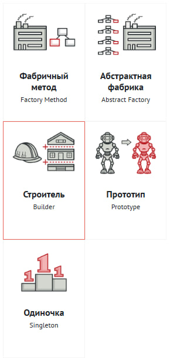
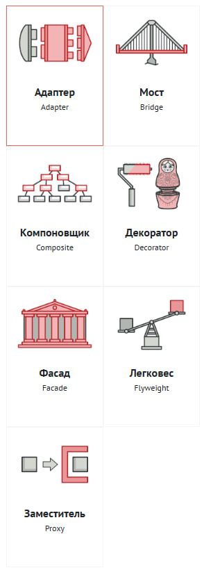
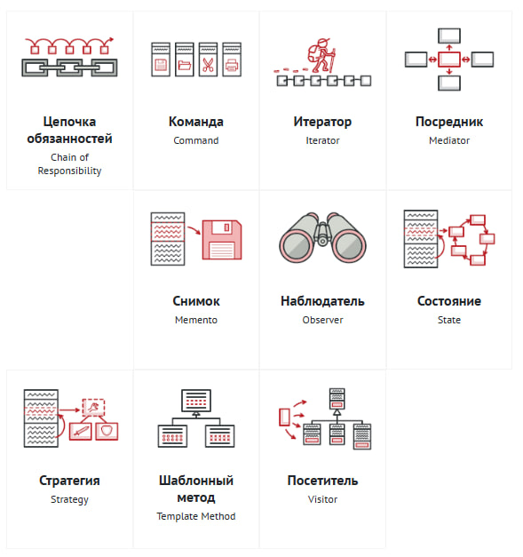

# Порождающие

- Отвечают за удобное и безопасное создание новых объектов или даже целых семейств объектов.



---

Пример из практики:

- Фабрика

```js
// ButtonFactory.js
function createButton(type) {
  switch (type) {
    case "primary":
      return <button className="btn btn-primary">Primary</button>;
    case "danger":
      return <button className="btn btn-danger">Danger</button>;
    default:
      return <button className="btn">Default</button>;
  }
}

// Использование
function App() {
  return (
    <div>
      {createButton("primary")}
      {createButton("danger")}
    </div>
  );
}
```

# Структурные

- Отвечают за построение удобных в поддержке иерархий классов.



---

Пример из практики:

- Декоратор

```js
// withLoading.js — HOC-декоратор
function withLoading(Component) {
  return function WithLoadingComponent({ isLoading, ...props }) {
    if (isLoading) return <div>Loading...</div>;
    return <Component {...props} />;
  };
}

// Пример использования
function UserList({ users }) {
  return (
    <ul>
      {users.map((u) => (
        <li key={u.id}>{u.name}</li>
      ))}
    </ul>
  );
}

const UserListWithLoading = withLoading(UserList);

// В компоненте
<UserListWithLoading isLoading={true} users={[]} />;
```

# Поведенческие

- Решают задачи эффективного и безопасного взаимодействия между объектами программы.



---

Пример из практики:

- Наблюдатель

React Context + useEffect реализуют этот паттерн.

```js
// theme-context.js
const ThemeContext = React.createContext();

// observer: компонент подписан на изменения темы
function ThemedButton() {
  const theme = React.useContext(ThemeContext);
  return (
    <button style={{ background: theme === "dark" ? "#333" : "#eee" }}>
      Click
    </button>
  );
}

// subject: изменение темы
function App() {
  const [theme, setTheme] = React.useState("light");

  return (
    <ThemeContext.Provider value={theme}>
      <ThemedButton />
      <button
        onClick={() => setTheme((t) => (t === "light" ? "dark" : "light"))}
      >
        Toggle Theme
      </button>
    </ThemeContext.Provider>
  );
}
```

[Original article](https://refactoringguru.cn/ru/design-patterns/catalog)
