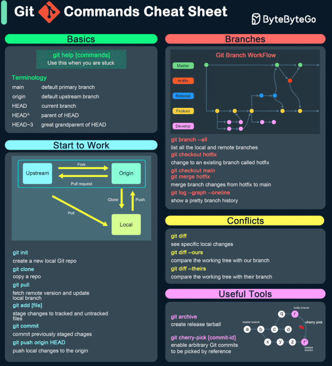

# Essential Git Cheatsheet

## Basic Commands

- git init – Initialize a new Git repository.
- git clone <repo_url> – Clone a remote repository.
- git status – Check the status of your working directory.
- git add <file> – Stage changes for commit.
- git commit -m "message" – Commit staged changes with a message.
- git push – Push your local commits to the remote repository.
- git pull – Fetch and merge changes from the remote repo.
- git diff – Show changes in the working directory (uncommitted changes).
- git diff --staged – Show changes between the staging area and last commit.

## Branching & Merging

- git branch – List branches.
- git branch <branch_name> – Create a new branch.
- git checkout <branch_name> – Switch to another branch.
- git checkout -b <branch_name> – Create and switch to a new branch.
- git merge <branch_name> – Merge a branch into the current one.
- git branch -d <branch_name> – Delete a branch after merging.
- git branch -D <branch_name> – Forcefully delete a branch, even if it hasn’t merged.

## Synchronization

- git fetch – Download changes from remote without merging.
- git rebase <branch> – Reapply commits on top of another branch to maintain linear history.
- git pull --rebase – Fetch and reapply your changes on top of the latest remote changes.
- git remote add <name> <url> – Add a new remote repository.

## Advanced Git

- git stash – Temporarily save changes without committing.
- git stash pop – Reapply stashed changes.
- git cherry-pick <commit> – Apply a specific commit to your current branch.
- git log --oneline – View simplified commit history.
- git reflog – Show the history of your reference changes (e.g., checkout, resets).
- git log --graph --decorate --all – Show a visual commit history.

## Undoing Changes

- git reset <file> – Unstage a file.
- git reset --soft <commit> – Reset to a commit but keep changes in the working directory.
- git reset --hard <commit> – Completely reset to a previous commit, discarding changes.
- git revert <commit> – Create a new commit that undoes a specific commit.

## Collaborating with Others

- git fork – Fork a repository on GitHub (via UI) to start contributing.
- git pull origin <branch> – Pull changes from the original remote branch.
- git push origin <branch> – Push your branch to the original repository for collaboration.

